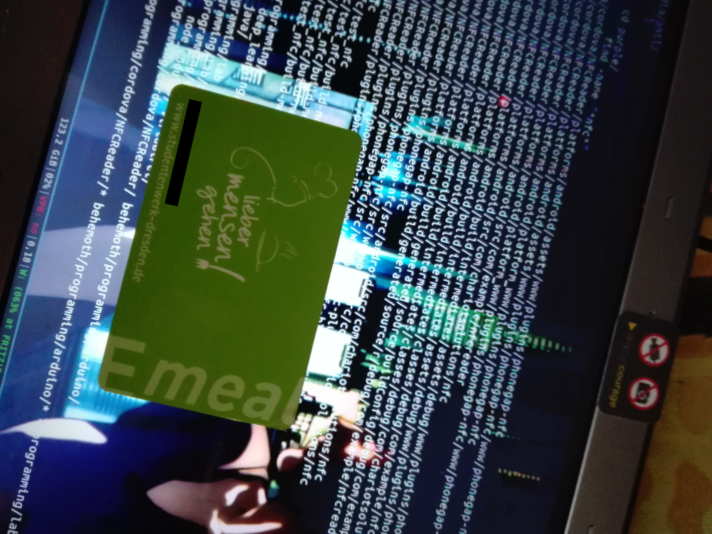

In this little project, I dived into the NFC technology in order to access the information of a local cafeteria card using both an [Android phone](cordova) and an [Arduino](arduino).

# Motivation

A topic bothering me was the security issue of RFID chips in all sorts of cards you have in your wallet. While I was buying a RFID block-condom for my ID at the 33C3, a guy from [digitalcourage](https://www.digitalcourage.de/themen/rfid) told me a lot of credit cards actually provide the credit card number as well as the date of expiration without any encryption. Creepy. So I decided (based on an idea by old [Justus](https://github.com/jusjusjus)) to check out the card of the cafeteria of the local university I'm doing my PhD at.

# Results

In the end I did not managed to access the card's information. The Android phone was just able to read the cards *Unique Identifier Number (UID)* and the Arduino shield did not recognize it at all. So it seems not that trivial to access this kind of information after all.

The whole story you can read in my blog.

In [part I](https://thegreatwhiteshark.github.io/thegreatwhiteshark.coding.io/hacks/mensacard-pt-i/) you will learn how to set up the developing environment to run [Apache Cordova](https://cordova.apache.org/) applications on your Android phone.

In [part II](https://thegreatwhiteshark.github.io/thegreatwhiteshark.coding.io/hacks/mensacard-pt-ii/) I switched from the plain Apache Cordova framework to [Ionic](http://ionicframework.com/). A step I late regretted and discarded. So it's more a short story about the meandering way into new concepts than an actual guide to the system.

The [final part](https://thegreatwhiteshark.github.io/thegreatwhiteshark.coding.io/hacks/mensacard-pt-iii/) concludes the Android part and introduces the Arduino shield. If you ever wanted to **use Emacs as your Arduino IDE**, be sure to check out this post. You will find a comprehensive guide in there.

## Requirements

- I will use an Huawei ALE-L21 phone running Android 6 and a Linux laptop running Ubuntu 16.10. The code should work for all new Android phones and Linux distributions too.
- An Arduino. I use my Arduino Mega but usual Uno will serve just fine. (You might have to change the corresponding Makefile)
- A NFC Arduino shield. I will use a [Elechouse NFC module V3](http://www.elechouse.com/elechouse/index.php?main_page=product_info&cPath=90_93&products_id=2242).

## Reference 

For everyone how wants to dive deeper into the subject of NFC, I can highly recommend the [Beginning NFC](https://www.amazon.com/Beginning-NFC-Communication-Arduino-PhoneGap/dp/1449372066/ref=sr_1_1?s=office-products&ie=UTF8&qid=1483802943&sr=8-1&keywords=igoe+nfc) by Tom Igoe, Don Coleman and Brian Jepson. It's very applied and you find a lot of actual code in there. It's clearly intended for makers and hardware enthusiasts. 
