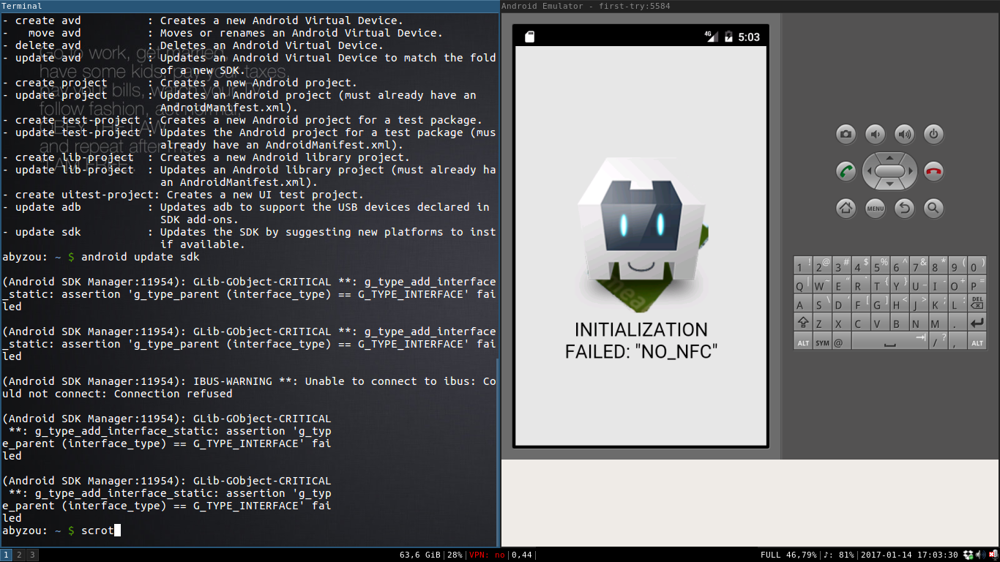

# Introduction
In this README I will go more into detail regarding the development of
the Apache Cordova app itself.

The starting point of this app is
the
[example app of the Beginning NFC book](https://github.com/tigoe/BeginningNFC/blob/master/NfcReader/www/js/index.js). For
convenience sake I placed the original versions of Cordova's
*config.xml* and the apps *index.html*, *index.css* and *index.js* in
*android/res/staring-point*.  

## Roadmap

But it is way to simple to serve our purposes. What we need is:

- A second view containing a table listing the cards already read
- Therefore the app has to be able to persistently store information
- We should be able to rename each item in the table
- Each card should appear only once (even if read multiple times)
- We need a function to write the content of a chosen item to a tag

## References
- The official documentation of [Apache Cordova](https://cordova.apache.org/docs/en/latest/)
- [JavaScript tutorial](https://www.tutorialspoint.com/javascript/)

# Developing on an Android emulator
The first thing we will do is setting up an Android emulator since we
do not want to have our phone attached to our computer all the time.

Well Google
[says](https://developer.android.com/studio/tools/help/android.html) 
the **android** CLI is not supported anymore. But since it is still
working quite fine we will just ignore this warning (I still refuse to
work with an IDE like Android Studio). If you followed the setup steps
in the main README.md file or the first part of my blog post you
should already have a running version of the program.

## Create an AVD (Android virtual device)
Using the android CLI we will just type in 
```
android create avd -n first-try -t android-23 -c 1000M --abi x86
```

So this will create an AVD named "first-try" with the *target*
android-23 resembling Android 6. You can view all available targets
using 

```
android list targets
```

With the *-c* Option we specified the amount of memory granted to the
Android virtual device. But be careful: it actually uses more than you
specify. E.g. for the 1GB I used it created a file of 3GB in size.

Last I also had to specify
the
[ABI](https://en.wikipedia.org/wiki/Application_binary_interface). I
choose a X86 architecture since this is the one my laptop is based
on. Not sure if this is the right choice to make. But it works for me.

## Installing the app on the AVD

Then we just have to power up our AVD (and wait until its completely
loaded)

```
android avd
```

and to go to the root android path of our cordova project and run the
app via 

``` 
cordova run --emulator
```



Nice. But keep in mind that there is no straight forward way to test
the NFC capabilities of the app! It's just a nice way to check the
validity of all the JavaScript code.

# Harden our app using a whitelist
On default we use the
[cordova-plugin-whitelist](https://cordova.apache.org/docs/en/latest/reference/cordova-plugin-whitelist/) which
allows only specified web pages and protocols to be accessed. But
since we do not need an API etc. let's configure the app to be able to
access only local files. 

Therefore we have to delete/comment all tags in Cordova's *config.xml* called **<access>** and **<allow-intent>**. 
